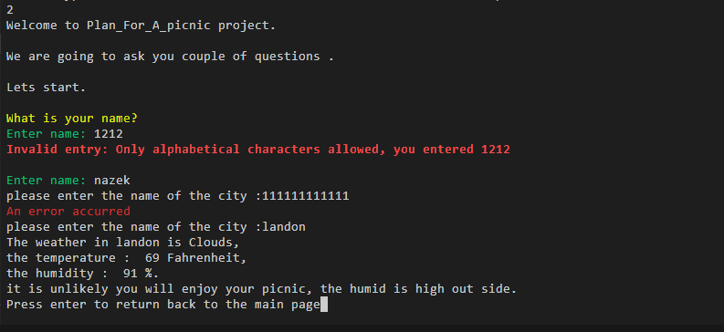
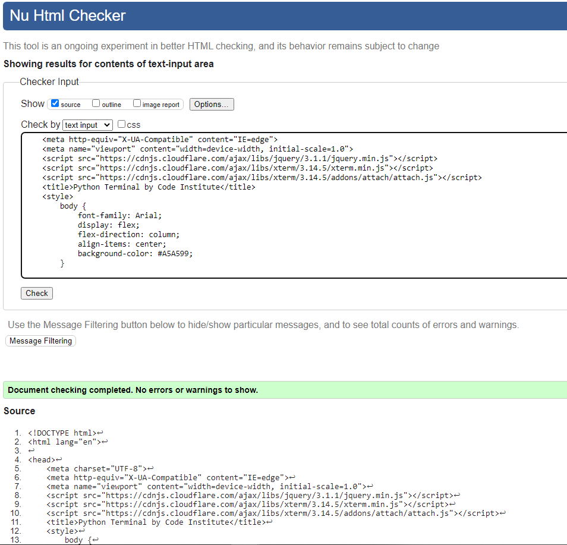
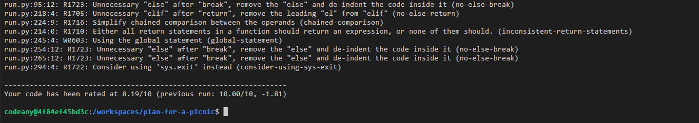

# Plan for a picnic

[Click this link to view the Website.](https://plan-for-picnic.herokuapp.com/)

# objective
   * The application present how useful could be the usage of API with Google sheets in helping user taking decisions.
   * A ccording to data analytics process at the data being entered by the user, the user will be able to decide  whether the weather helps to have a picnic and do some activity with the day or not. 

# User Experience
## Design / Colour scheme
   The mock terminal background is colored in 'Foggy Grey', 
   the 'Run Program' button is colored in Revolver,
   and the border of both has been colored in 'Grey Suit'.

## Target audience
  * Readers from all ages.
  * People that are looking for results according to some data they entered.
## User stories
   ### As a site owner, my goal is:

   * Presenting descriptions that will lead the user to learn about the purpose of the project.
   * Providing an easy-to-use and understandable questionnaire, means the user can easily learn the purpose of the questions before typing in the answers.
   * Guide the user through different options and steps, and display warning messages when ever user entered wrong data.

   ### As first time visitor:

   * I am expecting the site to describe it's self.
   * I am expecting to find various options that purposes are clearly described for each.
   * I am expection to be asked for entries are easy to think about and enter.
   * I am expecting the results that will be displayed later are meaningful and useful.
      
   ### As a returning visitor:

   * I am expecting my entries and the results i had got in my first visit are saved as a record, and i am able to browse them. 
   * I am expecting to find new features being added.

## UX Plane
   ### Scope
   * The entire application is on a single page site that runs in a mock terminal.
   ### Logic path
      a flow chart will be added here.

# Features
## Existing features
   * Load logo.
   * Display options.
   * Get entries from user.
   * Load weather info from 'Rapid api'.
   * Save resulted data in a google sheet.
## Planned features
   * Display nearest cities with related weather details according to the name of the city the user will enter.
   * Display the most temperate weather in the comming few days according to the name of the city the user will enter. 

# Testing
## Code Validation / User inputs.

The data being entered by user are validated to ensure the intended values are entered, the following are some examples 

## HTML Validation.
Changes have been make to the mock terminal style, accordingly the layout.html has been tested and the results come with no errors or warning.

## Python Validation

## Fixed bugs

+ If user entered not alphapatic value as a city name, he is asked to enter the city name besides his name also once again.
The bug was fixed by putting each input in a seperated validation block.

# Technologies
## Python libraries
1. ['time'](https://docs.python.org/3/library/time.html) imported to delay some contents that are displayed to the user.
2. [from 'os', 'system' and 'name'](https://docs.python.org/3/library/os.html) imported to help create the clear_console function.
3. ['requests'](https://docs.python-requests.org/en/latest/)  imported to simplify the calls to the API.
4. ['gspread'](https://docs.gspread.org/en/v5.3.2/) imported to link python project with the Google sheet.
5. ['from google.oauth2.service_account import Credentials'](https://pypi.org/project/google-oauth/) was used to link and allow the app access to information, namely Google sheets, in my Google account.

## CSS
Some css rules have been applied to the mock termainal (applied at both the body and 'run program' button)

# Deployment

## Deployment on Heroku.

1. After login click New button in the right top corner.
2. Chose app-name and region.
3. Choose settings in the bar.
4. Click reveal Config Vars and add Key Port and the Value 8000.
5. Add the buildpack heroku/python and heroku/nodejs in this order.
6. Click on Deploy in the bar.
7. Click on connect on github in the Deployment method section.
8. Click search in the connect to GitHUb section and choose the relevant github repository.
9. Click on Automatic deploys or manual deploy depending on preference. Manual deploy was chosen for this project.

## Make a local clone

1. Locate the GitHub repository. Link can be found [here](https://github.com/Nazek-Altayeb/plan-for-a-picnic).
2. Next to the green Gitpod button you will see a button "code" with an arrow pointing down
3. You are given the option to open with GitHub desktop or download zip
4. You can also copy the https full link, go to git bash and write git clone and paste the full link

## Fork the GitHub repository

1. Log into [GitHub](https://github.com/) or [create an account](https://github.com/).
2. Locate the GitHub repository. Link can be found [here](https://github.com/Nazek-Altayeb/plan-for-a-picnic).
3. At the top of the repository, on the right side of the page, select "Fork".
4. You should now have a copy of the original repository in your GitHub account.

# Credits

* Code Institute for ( link project to google sheet, deploy to mock terminal)

# Acknowledgements 

* Guidance of the mentor Reuben

 
  